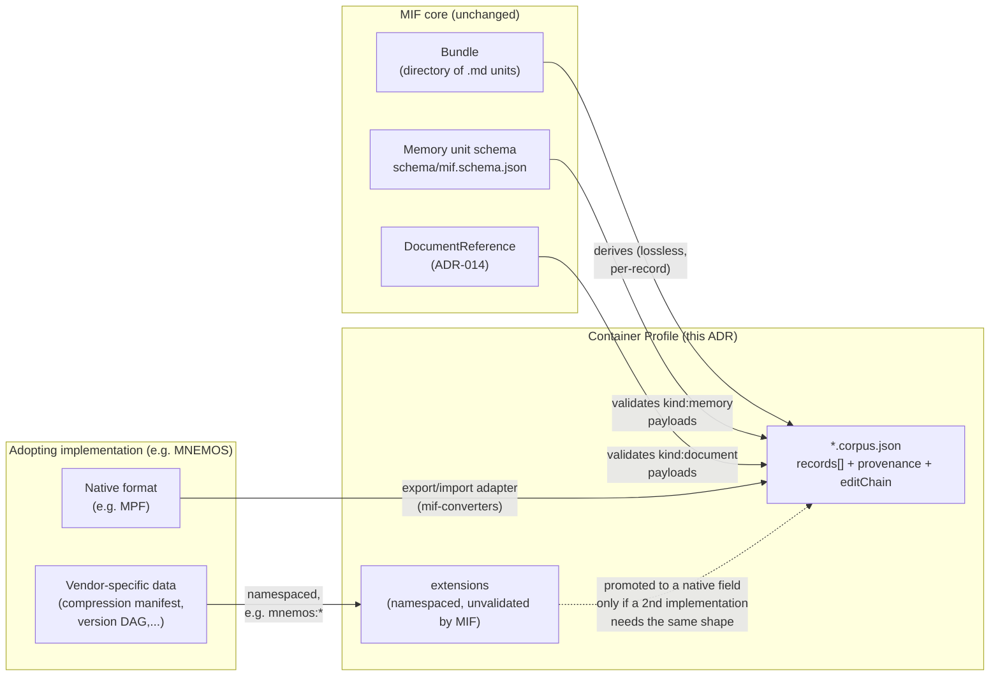

# ADR-021: Container Profile: A Derived Transport Envelope for Multi-Memory Corpora

## Status

Proposed

## Context

### Background and Problem Statement

MIF defines a single **memory unit** (`.md` frontmatter, derived `.jsonld`
projection, conformance Levels 1-3) and a **Bundle** (a directory of these
units, `SPECIFICATION.md` line 97, structure at §3.3) as the spec's existing
multi-memory mechanism. A Bundle is git-friendly, diffable and built for
authoring and storage.

Several tools need something Bundle does not provide: moving many memory
units, plus the source documents they derive from, across a *wire* boundary
(an API response, an export/import operation, a sync to a system that has no
concept of a file tree) as **one self-describing artifact**. Issue #77
("Proposal: Adopt the MPF Corpus Envelope as a MIF Container Profile",
originating from the MNEMOS/Charon project's independently-developed Memory
Portability Format) proposed exactly this: a `records[]` envelope with a
`kind` discriminator (`memory` | `document`), plus corpus-level metadata a
single unit or a Bundle does not carry (`provenance` for the corpus as a
whole, an edit/version lineage, a compression manifest, a federation cursor).

The maintainer's direction on discussion #60 (2026-06-26) settled the
per-unit questions the original proposal raised and explicitly separated the
envelope from that work:

> "The Container Profile and its corpus `records[]` envelope... The
> unit-level model is settled. The multi-record transport envelope is a
> distinct layer, and it belongs in a dedicated Architecture Decision Record
> (ADR). It is exactly what your draft PR #78 proposes."

Two coupling PRs against the original proposal (#205, #206) were reviewed
independently and found to still use the pre-realignment design: a flat
`memoryCategory` field the merged PR #83 guidance already rejects, an
embedded `DoclingDocument` payload the merged PR #84 / **ADR-014** already
rejects, inline placement in the canonical `SPECIFICATION.md` rather than
the ADR the maintainer asked for, and an example that fails schema
validation invisibly to CI. This ADR is the artifact the maintainer asked
for: it settles the envelope design *within* the already-decided per-unit
constraints, rather than reopening them.

### Current Limitations

- No single-file wire format exists for moving many memory units plus their
  source documents as one artifact; Bundle requires a file tree.
- No corpus-level metadata surface exists (corpus-wide provenance, an
  envelope version/edit lineage, a compression manifest, a federation
  cursor); these describe the *transfer*, not any one memory unit, and have
  no home in the per-unit schema.
- Issue #77's original design (still reflected in the open coupling PRs)
  reintroduces two already-rejected decisions (`memoryCategory`,
  `DoclingDocument` embedding) and leaves the envelope's relationship to
  Bundle, to OKF transport, and to `DocumentReference` (ADR-014)
  unreconciled: exactly the three items the maintainer named as open.

## Decision Drivers

### Primary Decision Drivers

1. **WHEN** a producer serializes a corpus for wire transport, **THE
   Container Profile SHALL** carry only memory records that are themselves
   independently valid per `schema/mif.schema.json` (each `conceptType`
   set; no parallel per-record schema).
2. **WHEN** a `kind: "document"` record is included, **THE Container
   Profile SHALL** carry it as a `DocumentReference` (ADR-014) and **SHALL
   NOT** embed a vendor document schema.
3. **WHERE** a corpus-level field would duplicate an existing per-unit
   construct (fact/event typing, provenance shape, supersession), **THE
   Container Profile SHALL** reuse the existing construct's shape rather
   than defining a second, incompatible one.
4. **IF** a container is disassembled back into a Bundle, **THEN THE**
   round-trip **SHALL** be lossless for every `kind: "memory"` record, via
   the same per-record JSON-LD -> Markdown projection Invariant 2 (ADR-011)
   already requires.
5. **WHERE** a corpus-level concept originates with a single adopting
   implementation and no second, independent implementation has yet needed
   the same shape, **THE Container Profile SHALL NOT** reserve native
   schema vocabulary for it. **IT SHALL** route through the existing
   `extensions` mechanism (`schema/mif.schema.json`'s per-unit `extensions`
   field, generalized to the corpus level). This keeps MIF's own spec
   surface minimal and keeps an adopting implementation's internal data
   model (compression internals, version-DAG mechanics, whatever it is)
   entirely its own to evolve, on its own schedule, without waiting on a
   MIF release. A concept is promoted from `extensions` to a native field
   only once a second, independent implementation demonstrably needs the
   same shape.

### Secondary Decision Drivers

1. **Discoverability by existing tooling**: the envelope's JSON-LD framing
   should either resolve correctly under a registered context or explicitly
   not claim JSON-LD framing it cannot honor; an artifact that silently
   drops content on `jsonld.expand()` is worse than one that is honest about
   not being JSON-LD-native.
2. **CI-visibility**: whatever file shape the envelope takes, it must be
   reachable by an explicit, automated validation path; not merely
   "well-formed JSON" with its content-validity claims untested.
3. **Minimal blast radius on the core context**: envelope-only vocabulary
   should not be added to `schema/context.jsonld`, which every memory unit's
   projection already depends on.

## Considered Options

### Option 1: Adopt issue #77 / PR #205's original design as-is

**Description**: A `records[]` envelope with `memoryType` (not
`conceptType`), a `memoryCategory` term for fact/event, `kind: "document"`
payloads that embed a full `DoclingDocument` and corpus-level
`provenance`/`edit_chain`/`compression_manifest`/`federation_cursor` fields
(the latter two natively named and MNEMOS-shaped, with no registered
JSON-LD terms), spliced directly into `SPECIFICATION.md`.

**Advantages**:
- Zero additional design work; matches the contributor's existing MPF
  format and reference-converter code as originally shipped.

**Disadvantages**:
- Reopens two decisions the maintainer already closed in writing on
  discussion #60 (`memoryCategory` rejected per merged PR #83;
  `DoclingDocument` embedding rejected per merged PR #84 / ADR-014).
- Ships schema-invalid examples that are invisible to CI (verified locally
  with `ajv` and `okf_validate.py` against PR #205's draft).
- Placed as canonical spec prose rather than the ADR the maintainer
  explicitly asked for.

**Risk Assessment**:
- **Technical Risk**: High; the design is already known to fail schema
  validation and JSON-LD expansion.
- **Schedule Risk**: High; merging as-is would require an immediate
  follow-up correction, doubling the review cycle.
- **Ecosystem Risk**: High; reintroduces vendor coupling (Docling) the org
  already ruled out for portability reasons.

### Option 2: No new envelope: reuse Bundle unmodified for corpus transport

**Description**: Do not add a Container Profile at all. Producers wanting to
move a corpus zip or stream a Bundle directory as-is (many `.md`/`.jsonld`
files plus a `config.yaml`).

**Advantages**:
- No new schema, no new context, no new CI surface. Bundle already exists
  and is fully specified.
- Preserves Invariant 2 exactly as-is: markdown stays canonical per file.

**Disadvantages**:
- No single-file wire artifact: an HTTP API response, a message-queue
  payload, or an air-gapped transfer that wants "one JSON blob" has no
  mechanism.
- No home for corpus-level-only metadata (a compression manifest, a
  federation cursor, corpus-wide provenance); these do not describe any one
  file in the directory, so Bundle's per-file model has nowhere to put them.
- Does not address the actual, demonstrated need: issue #77 and its
  70-round-adversarial-tested MNEMOS/Charon implementation already prove
  real consumers want this.

**Risk Assessment**:
- **Technical Risk**: Low; nothing new to build.
- **Ecosystem Risk**: Medium; leaves a real, externally-demonstrated need
  unaddressed, likely producing informal, incompatible single-file corpus
  formats per-implementer (exactly what MPF v0.1/v0.2 already was, before
  its author chose to align with MIF instead of forking).

### Option 3: Container Profile as a derived, optional transport serialization of a Bundle (chosen)

**Description**: A single JSON file (`*.corpus.json`) that is an explicit,
OPTIONAL, **derived** serialization of a Bundle (or a subset of one) for a
single wire transfer; not a competing storage format. Every `kind:
"memory"` record payload is exactly the JSON-LD projection of some canonical
`.md` unit and MUST independently satisfy `schema/mif.schema.json` (i.e.
`conceptType` is required, matching every other memory unit; see Decision).
Every `kind: "document"` record payload MUST be a `DocumentReference`
(ADR-014); a pointer, never an embedded vendor schema. Fact/Event
distinction is expressed via `namespace`, exactly as PR #83 already
established for every other memory unit; no `memoryCategory` field.
Corpus-level fields (`provenance`, `editChain`, `extensions`) are scoped as
**transport-only** metadata about the corpus artifact itself, explicitly
reusing existing shapes where one exists (§12.3's PROV convention for
`provenance`; the per-unit `extensions` mechanism, generalized to the
corpus level, for everything implementation-specific: compression
manifests, version DAGs and anything else a single adopter needs before a
second one asks for the same thing) rather than inventing incompatible
parallel ones or reserving native vocabulary for one vendor's roadmap. The
envelope gets its own registered JSON-LD context
(`schema/container-context.jsonld`) rather than extending the core
`schema/context.jsonld`, and its own explicit CI validation entry point
rather than relying on the `.md`-only gates.

**Advantages**:
- Fully consistent with every already-merged per-unit decision (PR #83,
  #84/ADR-014, #85); no reopened decisions.
- Addresses the real, demonstrated need (Option 2's gap) without competing
  with Bundle; a container is *derived from* a Bundle, not an alternative
  to it, so Invariant 2 still holds at the per-record level.
- JSON-LD framing is honest: the envelope vocabulary is registered and
  actually expands correctly, so no consumer is misled about what the
  artifact supports.
- CI-visible by construction: the Decision requires an explicit validation
  entry point for `*.corpus.json`, closing the gap Option 1 shipped.

**Disadvantages**:
- More design work up front than Option 1 (new schema, new context, new CI
  step); though see Decision Outcome for the concrete, bounded scope.
- A second artifact shape (Bundle directory vs. corpus file) for
  implementers to understand, even though one derives from the other.

**Risk Assessment**:
- **Technical Risk**: Low; every building block (per-unit schema,
  `DocumentReference`, §12.3 provenance shape) already exists and is
  tested; this option composes them rather than inventing new primitives.
- **Schedule Risk**: Low-Medium; requires a follow-on schema/context/CI PR
  once this ADR is accepted, but no further design negotiation, since every
  open question is resolved here.
- **Ecosystem Risk**: Low; directly unblocks the MNEMOS/Charon contribution
  path issue #77 and discussion #60 already committed to, on terms the
  maintainer already specified.

## Decision

MIF adopts **Option 3**. The Container Profile is an OPTIONAL, single-file
JSON artifact (`*.corpus.json`) that serializes a Bundle, or a subset of one,
for wire transport. It is explicitly a **derived transport projection**, not
a second canonical storage format. Bundle remains the authoring/storage
shape; a container is what a Bundle looks like serialized to cross a wire
boundary once.



**Envelope shape:**

```json
{
  "@context": "https://mif-spec.dev/schema/container-context.jsonld",
  "@type": "MemoryCorpus",
  "containerProfileVersion": "0.1.0",
  "records": [
    {
      "kind": "memory",
      "payload": {
        "...": "a full MIF memory JSON-LD projection, conceptType required"
      }
    },
    {
      "kind": "document",
      "payload": {
        "@type": "DocumentReference",
        "hash": {
          "algorithm": "sha256",
          "value": "..."
        },
        "contentType": "application/pdf",
        "byteLength": 128374,
        "url": "https://..."
      }
    }
  ],
  "provenance": {
    "@type": "prov:Entity",
    "wasDerivedFrom": {
      "@id": "urn:mif:bundle:ncp-requirements"
    }
  },
  "editChain": [],
  "extensions": {
    "mnemos:compressionManifest": {
      "...": "MNEMOS's own shape; not MIF-validated, not MIF vocabulary"
    }
  }
}
```

**Specific decisions on every point this ADR was asked to settle:**

1. **`memoryCategory` is rejected.** `kind: "memory"` records use
   `conceptType` (`semantic` | `episodic` | `procedural`) exactly as every
   other memory unit does. Fact vs. Event distinction is expressed via
   `namespace` (e.g. `_semantic/requirements/facts` vs. `_episodic/events`),
   per the already-merged PR #83 guidance and `SPECIFICATION.md` §4's
   existing prohibition on flat category fields. No envelope-level or
   record-level `memoryCategory` field exists.
2. **Documents travel by `DocumentReference`, never embedded.**
   `kind: "document"` record payloads MUST be a `DocumentReference` object
   (ADR-014): `hash`, `contentType`, `byteLength`, located by `url` or
   `id`. A producer holding a Docling parse (or any other vendor
   representation) references it; it is never embedded inline. Shipping
   the actual document bytes alongside a container (e.g. for offline/
   air-gapped transfer) is explicitly **out of scope for this ADR**; a
   future ADR may define a side-channel blob map keyed by `hash`, but the
   primary record shape stays a pointer.
3. **Container Profile does not replace Bundle; it is derived from one.**
   A container's `records[]` (for `kind: "memory"` entries) are exactly the
   JSON-LD projections of the `.md` units a Bundle would otherwise hold.
   Invariant 2 (ADR-011: markdown is canonical, JSON-LD is derived) applies
   per-record: if a consumer needs the canonical markdown form, it runs the
   existing JSON-LD -> Markdown projection on each `kind: "memory"` payload,
   the same operation `mif_convert.py` already performs for any other
   JSON-LD projection. A container is not required to state a `Bundle`
   equivalence explicitly, but SHOULD set `provenance.wasDerivedFrom` to the
   source Bundle's identifier when one exists, for traceability.
4. **Corpus-level `provenance` reuses §12.3's PROV shape exactly.** Keys stay
   plain (no `prov:` prefix) except `@type`; `wasDerivedFrom` (and any other
   PROV relation) takes object form `{"@id": "..."}`, never a bare string
   with a prefixed key. This is the identical rule §12.3 already states for
   memory-unit-level provenance, applied unchanged at the corpus level.
5. **The corpus version field is named `containerProfileVersion`, not
   `mif_version`.** `mif_version` already means something different; an
   implementation's declared spec-conformance version in `.mif/config.yaml`
   (§13.4). Reusing the name at the corpus-envelope root for a different
   concept was rejected as a naming collision.
6. **`editChain` is transport-only metadata about the envelope, and is
   explicitly subordinate to each record's own `Supersedes` relationship.**
   It records the corpus artifact's own edit/transfer lineage (e.g. "this
   container supersedes container transfer X" for incremental/federated
   sync); it is not a second source of truth for whether one *memory*
   supersedes another. If a `kind: "memory"` record's own frontmatter
   `relationships[]` states a `Supersedes`/`SupersededBy` relationship
   (§8.2) and a corpus-level `editChain` entry disagrees about that same
   pair, **the per-record relationship wins**. `editChain` is a derived
   convenience index over the envelope's own transfer history, not a
   canonical fact about any memory. This mirrors Invariant 2's
   markdown-wins precedence: the more granular, per-unit source of truth
   always wins over a coarser, envelope-level derived index.
7. **`compressionManifest`, `federationCursor` and any other
   implementation-specific corpus metadata are NOT native schema fields:
   they live in a corpus-level `extensions` object**, generalizing the
   per-unit `extensions` field `schema/mif.schema.json` already defines
   (`additionalProperties: true`, provider-namespaced keys like
   `subcog:domain` today). A corpus produced by MNEMOS/Charon carries its
   compression manifest as `extensions."mnemos:compressionManifest"` and its
   version-DAG/edit-lineage detail as `extensions."mnemos:versionDag"`, in
   MNEMOS's own shape, unvalidated and unconstrained by MIF, evolving on
   MNEMOS's own schedule. This is not a placeholder pending a future ADR;
   it is the durable answer. Per Decision Driver 5, a concept graduates from
   `extensions` to a native Container Profile field only when a second,
   independent implementation demonstrably needs the identical shape;
   until then, reserving native vocabulary for it would encode one vendor's
   internal data model as MIF's own, exactly the coupling this ADR exists to
   avoid. This is deliberately protective in both directions: MIF's spec
   surface never grows to track one adopter's roadmap, and that adopter
   never has to wait on a MIF release, or conform its internals to a shape
   MIF has not actually agreed on yet, to ship its own feature.
8. **JSON-LD registration: a dedicated `schema/container-context.jsonld`,
   not an extension of the core context.** `MemoryCorpus`, `records`,
   `kind`, `payload`, `containerProfileVersion`, `editChain`, and
   `extensions` are registered there. The core `schema/context.jsonld` —
   which every memory unit's projection already depends on — is not
   modified. A container's `@context` therefore points at the
   container-specific context, not the bare memory-unit context.
   `extensions` is mapped as `{"@id": "mif:extensions", "@type": "@json"}`
   — deliberately **not** the core context's `@container: @index` pattern
   its per-unit namesake uses (`schema/context.jsonld:297-300`). Verified
   directly with `pyld`: `@container: @index` silently drops the *value* at
   each index key on expansion (only the key itself survives — the same
   class of content-loss defect this whole ADR exists to fix, recurring in
   a new field), while `@type: @json` carries the entire `extensions`
   object as an opaque JSON-LD literal, round-tripping 100% of arbitrary
   vendor content through expand and compact with zero imposed vocabulary —
   exactly the "unvalidated, vendor-owned" intent of Decision point 7, and
   still genuinely correct JSON-LD.
9. **CI visibility: an explicit, container-aware validation entry point is
   REQUIRED, not optional.** Because `scripts/mif_convert.py`'s
   `iter_concepts()` only discovers `*.md` files, a `*.corpus.json` file is
   invisible to the existing gates by construction. The implementation adds
   a standalone `scripts/validate_container.py` that discovers
   `*.corpus.json` files directly, validates the envelope against
   `schema/container.schema.json`, and validates each record's `payload`
   against the correct external schema per `kind` — `schema/mif.schema.json`
   for `kind: "memory"`, and a small wrapper schema
   `schema/document-reference.schema.json` (a `$ref` onto
   `mif.schema.json`'s `DocumentReference` `$defs` entry — `ajv-cli` cannot
   take a `#/$defs/...` fragment appended to its `-s` flag directly,
   confirmed by testing) for `kind: "document"`. Wired into
   `.github/workflows/validate.yml` as its own job, so a schema-invalid
   example can never again pass CI silently the way PR #205's did.
10. **Directory placement: no new `profiles/` directory.** Unlike
    `profiles/ai-memory/` (which adds domain *vocabulary*: entity types and
    ontology terms, and is correctly a profile), the Container Profile adds
    a *wrapping transport format* with no new content vocabulary of its own.
    Its home is `schema/container.schema.json` +
    `schema/container-context.jsonld` (siblings of `schema/mif.schema.json`),
    with worked examples under `examples/container/` (a new, CI-wired
    subdirectory of the existing `examples/` tree; not `profiles/`, since
    there is no domain content to scope there). Documentation lives as its
    own top-level doc (`docs/CONTAINER-PROFILE.md`), referenced from
    `SPECIFICATION.md` by a single cross-reference sentence; mirroring the
    *reference* pattern `profiles/ai-memory/` uses from the core spec,
    without adopting its directory structure, since the two profiles differ
    in kind (content vocabulary vs. transport serialization).

## Consequences

### Positive

1. **No reopened decisions**: fully consistent with PR #83 (`conceptType`
   over `memoryCategory`), PR #84/ADR-014 (`DocumentReference` over
   embedding), and PR #85/ADR-013 (provenance shape); the implementation
   cannot regress any of the three.
2. **Bundle stays authoritative**: no second canonical storage format;
   Container Profile is explicitly a derived, optional transport shape.
3. **CI cannot silently pass invalid containers**: the mandatory
   container-aware validation entry point (Decision point 9) closes the
   exact gap that let PR #205's schema-invalid example ship with green CI.
4. **Unblocks the MNEMOS/Charon contribution path** issue #77 and
   discussion #60 already committed to, on terms the maintainer already put
   in writing.
5. **MNEMOS stays whole.** Nothing in this ADR requires MNEMOS to give up
   MPF internally, restructure its compression engine, or redesign its
   version-DAG mechanics to match a MIF-blessed shape; those stay entirely
   MNEMOS's own, expressed as `extensions."mnemos:*"` at the one boundary
   where the two systems actually touch (the converter). MIF gains a
   transport format; MNEMOS loses nothing.

### Negative

1. **`extensions` content is unvalidated by MIF.** Because `extensions` is
   `additionalProperties: true` by design (Decision point 7), MIF's own
   gates cannot catch a malformed `mnemos:compressionManifest`; validating
   that shape is entirely MNEMOS's own responsibility, in its own tooling.
   This is the direct cost of the isolation Positive #5 describes: MIF
   cannot protect an adopter from its own extension-content bugs, because
   protecting it would require MIF to understand a schema it deliberately
   does not own.
2. **Two artifact shapes for implementers to hold in mind** (Bundle
   directory, corpus file); mitigated by the derivation relationship being
   explicit and mechanical (per-record bidirectional JSON-LD/Markdown,
   already-existing tooling), but real nonetheless.

### Neutral

1. **Document bytes vs. document references**: choosing pointer-only
   document records (Decision point 2) means air-gapped/offline transport
   scenarios needing actual document bytes inline are not served by this
   ADR; noted as explicitly out of scope rather than silently unaddressed.

## Decision Outcome

Implementation lands in this same change: `schema/container.schema.json`,
`schema/container-context.jsonld`, `schema/document-reference.schema.json`,
`scripts/validate_container.py`, a `container-validation` job in
`.github/workflows/validate.yml`, `examples/container/*.corpus.json`, and
`docs/CONTAINER-PROFILE.md` plus a `SPECIFICATION.md` cross-reference. This
ADR's `Status` stays **Proposed** rather than moving to `Accepted`: per the
maintainer's own release-gating statement on discussion #60 ("Once you have
reviewed the five PRs, confirmed the per-unit concerns are addressed and
acknowledged that the Container Profile is correctly scoped as separate
follow-on work, we will tag and release v1.0.0."), full acceptance is tied
to `@perlowja` confirming on issue #77 that these terms address the
corpus-envelope concerns — that confirmation has not happened yet. See
Audit below.

## Related Decisions

- [ADR-006: EntityData vs EntityReference](ADR-006-entitydata-vs-entityreference.md): the reference-over-inline preference this decision also applies to corpus-level document records.
- [ADR-009: OKF Compliance as a Superset](ADR-009-okf-compliance-superset.md): the Container Profile is an additive MIF layer over the OKF-conformant unit, and it does not alter OKF conformance of any individual record.
- [ADR-010: Repositioning to Modeled Information Format](ADR-010-modeled-information-format-repositioning.md): the vendor-neutral positioning this decision extends to corpus-level document handling.
- [ADR-011: Markdown Canonical, Derived JSON-LD](ADR-011-markdown-canonical-derived-jsonld.md): Invariant 2, applied per-record within a container (Decision point 6).
- [ADR-013: Provenance: Lightweight Core + Optional W3C-PROV Layer](ADR-013-provenance-lightweight-core-optional-prov-layer.md): the §12.3 shape this decision reuses verbatim at the corpus level.
- [ADR-014: Source Documents Travel by Reference, Not by Embedded Vendor Schema](ADR-014-document-reference-not-embed.md): governs every `kind: "document"` record payload in a container.

## Links

- [GitHub issue #77](https://github.com/modeled-information-format/MIF/issues/77): the originating corpus-envelope proposal this ADR settles.
- [GitHub discussion #60](https://github.com/orgs/modeled-information-format/discussions/60): the maintainer direction (2026-06-26 comment) this ADR implements: `memoryCategory` rejected, `DocumentReference` required, envelope belongs in a dedicated ADR, Bundle/OKF reconciliation and document-posture-vs-`DocumentReference`-composition are the open items this ADR resolves.
- [MIF PR #205](https://github.com/modeled-information-format/MIF/pull/205): the open coupling PR whose design this ADR supersedes on every point listed in Context.
- [MIF PR #206](https://github.com/modeled-information-format/MIF/pull/206): the companion Level-1 MemPalace mapping PR, correctly scoped and out of this ADR's remit.
- [MNEMOS / mnemos-os/mpf](https://github.com/mnemos-os/mpf): the independently-developed Memory Portability Format this ADR realigns to MIF as an optional profile, per the contributor's own stated intent on discussion #60.

## More Information

- **Date:** 2026-07-10
- **Source of the constraints this ADR resolves:** `SPECIFICATION.md` §4 (fact/event via namespace), §5.2 (`extensions:` field, provider-namespaced), §8.2 (Supersedes/SupersededBy), §12.3 (PROV provenance shape), §13.4 (`mif_version` in `.mif/config.yaml`); `adr/ADR-014-document-reference-not-embed.md`; `schema/mif.schema.json` (`conceptType` required, `$defs.DocumentReference`, `extensions` with `additionalProperties: true`); `schema/context.jsonld:297-300` (the per-unit `extensions` term's `@container: @index` mapping, which this ADR's corpus-level `extensions` deliberately does not reuse — see Decision point 8).
- **Verification performed before drafting:** live `ajv` schema validation and `pyld.jsonld.expand()`/`compact()` against real schema and context files, including empirically confirming the `ajv-cli` `$defs`-fragment limitation and the `@container: @index` content-loss defect this ADR's Decision points 8-9 resolve.
- **Related ADRs:** ADR-006, ADR-009, ADR-010, ADR-011, ADR-013, ADR-014.

## Audit

### 2026-07-10 (initial proposal)

**Status:** Pending

**Findings:**

| Finding | Files | Lines | Assessment |
|---------|-------|-------|------------|
| No implementation exists yet; this ADR is Proposed, not Accepted | n/a | n/a | pending |
| `schema/container.schema.json` / `schema/container-context.jsonld` not yet created | n/a | n/a | pending |
| Container-aware CI validation entry point not yet added | `.github/workflows/validate.yml` | n/a | pending |
| `examples/container/*.corpus.json` worked examples not yet authored | `examples/container/` | n/a | pending |

**Summary:** This ADR records the design decision only. No code, schema, or
CI change has been made under it yet.

**Action Required:** Implement the items in Decision Outcome, then re-audit
against the actual files/lines.

### 2026-07-10 (implementation)

**Status:** Partial

**Findings:**

| Finding | Files | Lines | Assessment |
|---------|-------|-------|------------|
| `MemoryCorpus` envelope schema present, `additionalProperties: false`, `kind`-dispatched `if`/`then` on `conceptType`/`@type` | `schema/container.schema.json` | 37 (`@type` const), 133-217 (`Record` `$defs`) | compliant |
| Envelope JSON-LD context registered, `extensions` mapped `@type: @json` (not the per-unit `@container: @index` pattern — confirmed via `pyld` that the latter drops content on expand) | `schema/container-context.jsonld` | 49 | compliant |
| `DocumentReference` wrapper schema for `kind: "document"` validation (`ajv-cli` cannot take a `#/$defs/...` fragment on `-s` directly) | `schema/document-reference.schema.json` | 1-6 | compliant |
| Container-aware CI validation entry point added, no path filter on `pull_request` | `.github/workflows/validate.yml` | 97-119 | compliant |
| Dedicated validator: envelope + per-record `kind`-dispatched `ajv` validation, `extensions` deliberately unvalidated | `scripts/validate_container.py` | full file | compliant |
| Worked example: 2 memory records (fact + event, `namespace`-distinguished, no `memoryCategory`), 1 `DocumentReference` document record, `extensions."mnemos:compressionManifest"` | `examples/container/ncp-requirements.corpus.json` | full file (71 lines) | compliant |
| Reference documentation | `docs/CONTAINER-PROFILE.md` | full file (135 lines) | compliant |
| Cross-reference from both spec surfaces (source + Starlight mirror) | `SPECIFICATION.md`, `src/content/docs/specification/overview.mdx` | 29, 10 | compliant |

**Summary:** All five Decision Outcome implementation items are complete and
locally verified: `python scripts/validate_container.py examples/container`
passes; both new schemas compile clean (`ajv compile --strict=false`); the
existing `okf_validate.py`, `mif_convert.py roundtrip`, and the
`schema-validation` job's `ajv` loop over the pre-existing `.md` example
trees are all unaffected (still exactly 13 concepts checked, unchanged); the
worked example round-trips losslessly through `pyld` `expand`/`compact`
(`records[]` and `extensions` both survive, unlike PR #205's design); the
Astro site builds clean (`npm run build` → `Complete!`).

Item 5 (formally requesting `@perlowja`'s confirmation on issue #77) is
**not done** — this is an external, social step, not a local implementation
task, and this work has not been pushed or posted anywhere. `Status` stays
**Proposed** until that confirmation happens; this audit entry records
`Partial` (implementation verified, external sign-off outstanding), not
`Compliant`.

**Action Required:** None for the code. Formally request `@perlowja`'s
confirmation on issue #77 once this branch is ready to open as a PR, then
re-audit and move `Status` to `Accepted`.
